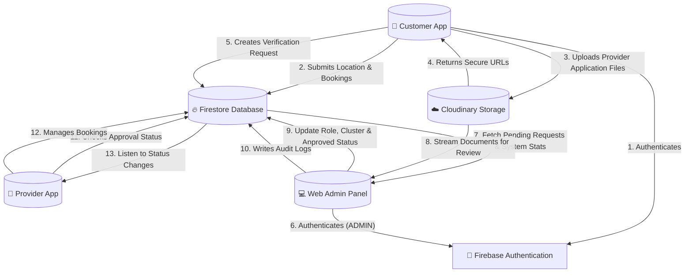
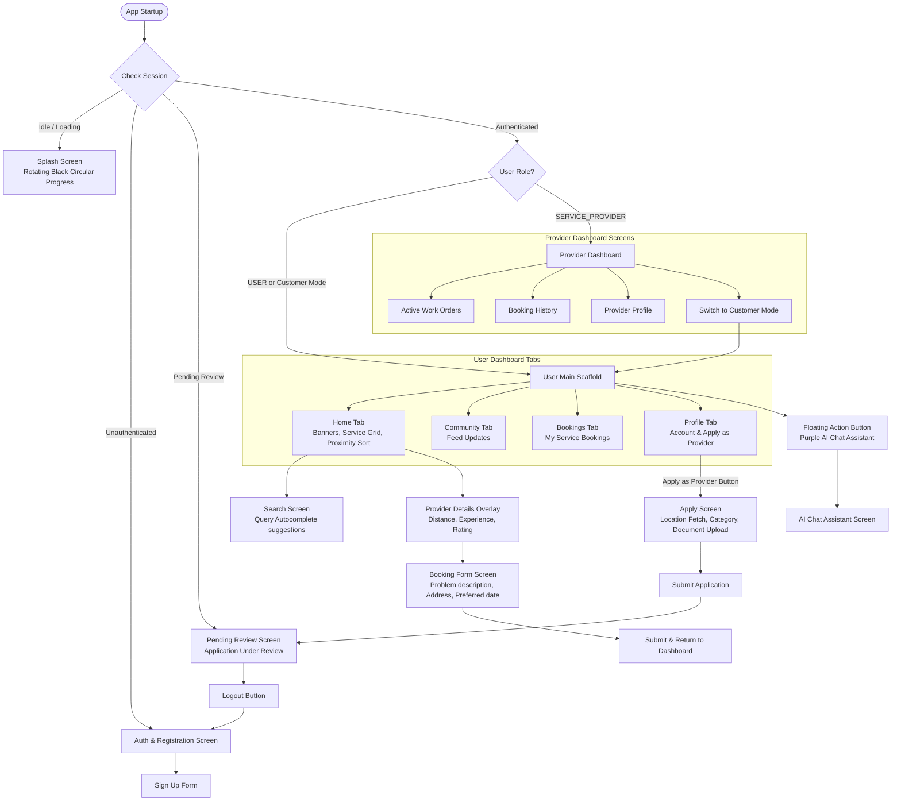
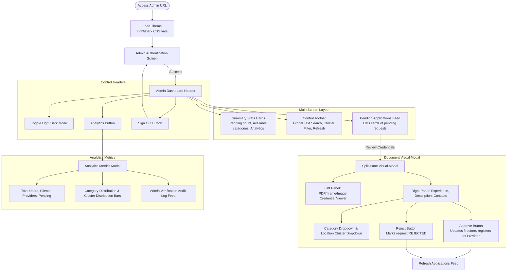

# LBO Marketplace: System Architecture & UI/UX Design

This document provides a detailed overview of the LBO Marketplace platform, including its core architectural concepts, user interface (UI) design system, Data Flow Diagram (DFD), and UI Navigation flows.

---

## 1. Application Overview
**LBO Marketplace ("Together We Grow")** is a local services discovery and professional booking marketplace. It bridges the gap between local expert service providers (plumbers, lawyers, AC technicians, carpenters, etc.) and clients/customers within specific geographic clusters.

The platform consists of two primary applications sharing a unified **Firebase & Cloudinary backend**:

### A. Android Mobile Application (Kotlin + Jetpack Compose)
* **Dual Roles**: Supports two user roles:
  * **Customer Mode**: Users can search for local services, filter providers by proximity (within an 18 km radius prioritized first, then sorted from nearest to farthest), browse provider profiles, submit booking requests, read community updates, and consult an AI chat assistant.
  * **Provider Mode**: Service providers can manage active work orders, view booking histories, update services offered, and toggle between provider and customer roles.
* **Onboarding & Registration**: Streamlined authentication flow with automatic checks to verify if a provider's registration has been approved.

### B. Console Admin Web Panel (React + Vanilla CSS)
* **Verification Engine**: Allows platform administrators to review, categorize, cluster, and approve/reject pending provider applications.
* **Visual Document Viewer**: A split-pane modal to inspect uploaded verification credentials (documents, PDFs, photos) alongside provider profiles.
* **Database & Analytics Dashboard**: Pulls system-wide stats from Firestore (Total Users, Approved Providers, Customers, Pending Verifications) and graphs service category/cluster distributions.
* **Auditing Logs**: An admin activity audit trail showing which admin approved/rejected which provider and when.

---

## 2. UI Theme & Design System

The platform is designed around a **Premium Monochrome (Black-and-White) Aesthetic**, giving it a modern, high-contrast, professional feel.

### A. Mobile UI (Jetpack Compose)
* **High Contrast Color Scheme**:
  * **Backgrounds & Surfaces**: Forced pure white (`#FFFFFF`) to ensure clean contrast and reduce visual noise. Dynamic Material 3 colors are disabled to maintain the brand aesthetic.
  * **Typography & Accents**: Pure black (`#000000`) for headers, primary text, and border strokes.
  * **Interactive Components**: Buttons use solid black containers with white text (`colors = ButtonDefaults.buttonColors(containerColor = Color.Black)`). Rounded corners are set to `12.dp` or `16.dp`.
  * **Status & Highlights**: Muted yellow (`#FFC107`) is reserved for rating stars. The AI chat floating action button is styled with a distinct purple container (`#6C63FF`) to indicate assistant utility.

### B. Admin Web Panel UI (Vanilla CSS)
The admin panel implements a custom design system with custom properties declared in `index.css`:

| Token | Light Mode Value | Dark Mode Value |
| :--- | :--- | :--- |
| `--bg-app` | `#fcfcfc` (Soft off-white) | `#080808` (Deep black) |
| `--bg-card` | `#ffffff` | `#111111` (Rich dark gray) |
| `--bg-input` | `#f5f5f7` | `#1b1b1f` |
| `--color-primary` | `#000000` | `#ffffff` |
| `--color-text-primary`| `#121212` | `#f5f5f7` |
| `--border-color` | `#e2e2e8` | `#222228` |

#### Key Visual Patterns:
* **Glassmorphism**: Top nav bar and control toolbars use `.glass-panel` style with `backdrop-filter: blur(20px)` and semi-transparent backgrounds to create depth.
* **Micro-animations**: Interactive elements use cubic-bezier transitions (`0.3s cubic-bezier(0.16, 1, 0.3, 1)`):
  * Cards elevate slightly (`translateY(-4px)`) and glow with a subtle shadow on hover.
  * Toasts slide up dynamically from the bottom right corner when triggered.
* **Monochrome Badges**: Status badges use clear, low-saturation backgrounds for feedback:
  * `Pending`: Warning Yellow (`#f59e0b` text, `10%` opacity background)
  * `Approved`: Success Green (`#10b981` text, `10%` opacity background)
  * `Rejected`: Error Red (`#ef4444` text, `10%` opacity background)

---

## 3. Data Flow Diagram (DFD)

The following diagram illustrates how data travels between the client, provider, administrator, and backend services.

---

## 4. UI Navigation Diagram

This flowchart outlines the navigation pathways for both mobile users and web administrators.

### A. Mobile Application Navigation Path

### B. Admin Console Web Panel Navigation Path

---

## 5. UI Features & Best Practices Implemented

1. **Location & Distance Calculation**:
   * Uses real-time GPS location coordinates (`ACCESS_FINE_LOCATION`) on mobile devices.
   * Fallback engine pulls registered address details from Firestore and converts them to coordinates.
   * Calculates distance between user and provider using the Haversine formula, prioritizing providers within 18 km.
2. **Smart Application Verification Suggestions**:
   * The admin panel processes address texts and details to auto-suggest location clusters (Sangli, Kolhapur, Belgaum, Ichalkaranji) and matches the submitted service category to standard classifications to reduce manual workload.
3. **Session Verification State Machine**:
   * Restricts screen access based on authentication token verification. A provider whose application is approved is immediately redirected from the "Application Under Review" screen to the "Provider Dashboard" without manual re-login.
4. **Cloudinary Integration**:
   * Media URLs generated securely from Cloudinary are loaded in the admin verification panel using native iframes/image containers with a fallback spinner indicator for slow networks.
